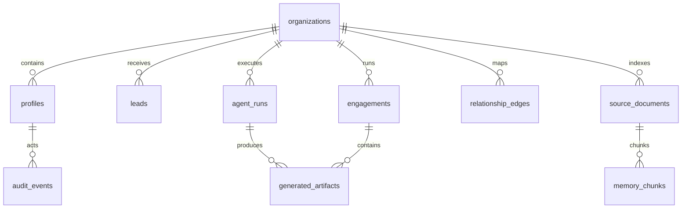

# Entity Relationship Diagram

    _Generated: 2026-06-21. Reconstruction confidence is bounded by accessible project memory/context and the current chat session._

```mermaid
erDiagram
  organizations ||--o{ profiles : contains
  organizations ||--o{ leads : receives
  organizations ||--o{ engagements : runs
  organizations ||--o{ source_documents : indexes
  source_documents ||--o{ memory_chunks : chunks
  organizations ||--o{ relationship_edges : maps
  organizations ||--o{ agent_runs : executes
  agent_runs ||--o{ generated_artifacts : produces
  engagements ||--o{ generated_artifacts : contains
  profiles ||--o{ audit_events : acts
```
